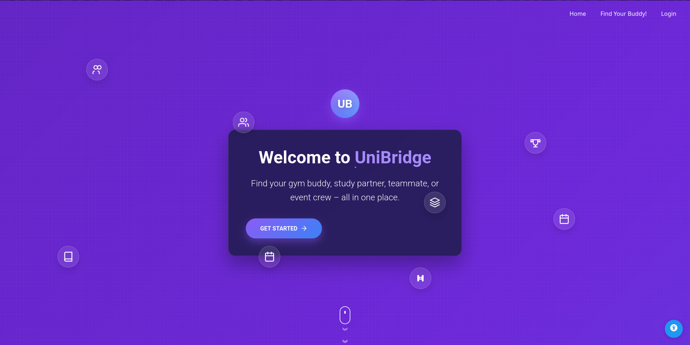
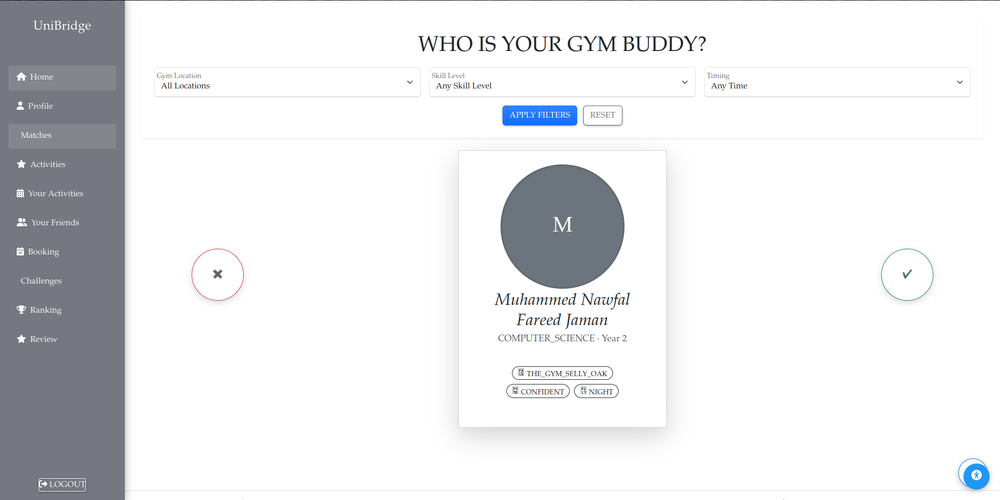
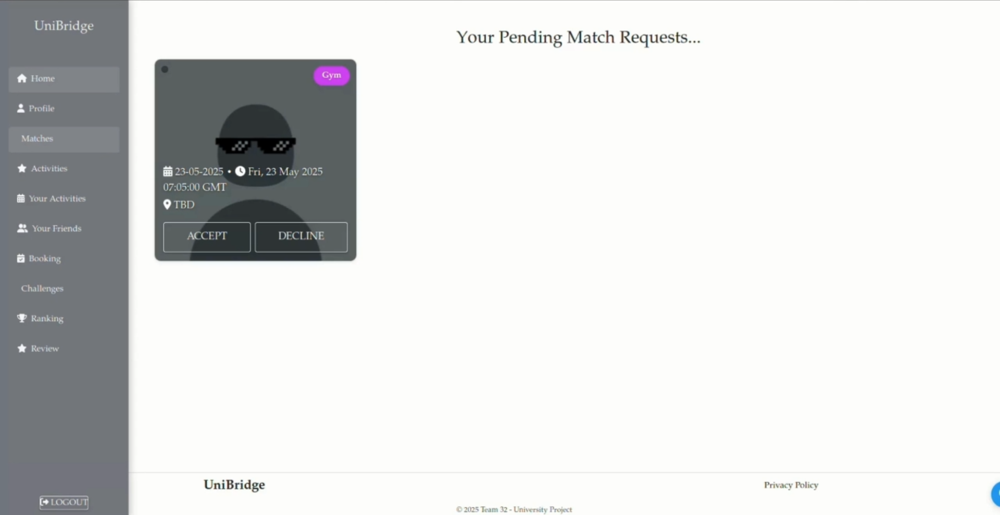
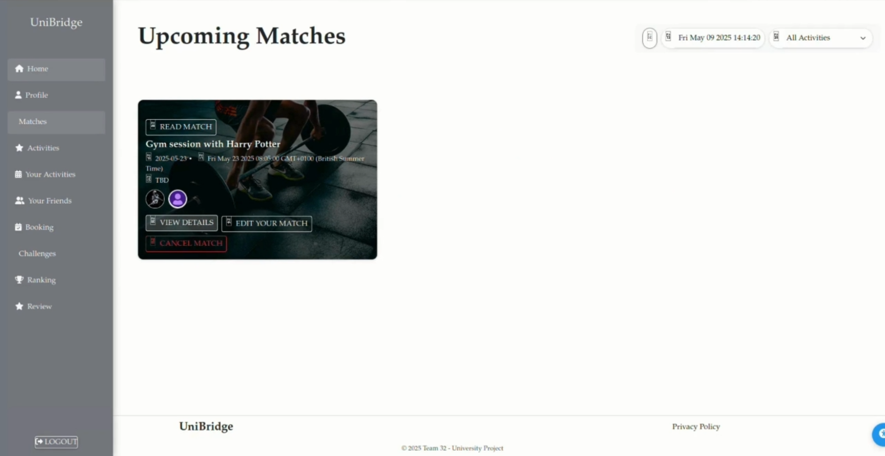
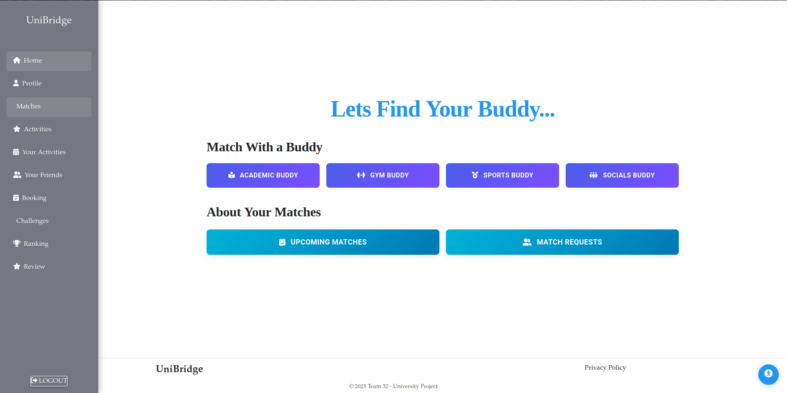

# 🌉 Unibridge

Unibridge is a full-stack web application designed to help university students connect with each other for **social, academic, and fitness activities**. Whether it’s finding a study buddy, joining a society session, scheduling a gym partner, or forming a sports team, Unibridge makes it simple to meet like-minded students.

---

## ✨ Features

- 🎯 **Activity Matching**  
  Match with other students based on interests and activities. Users can swipe to match/reject a profile, and schedule upcoming sessions on gym preferences, sports interests, study habits, and availability.
  
- ➕ **Activity Management**  
  Create, browse, and join activities such as study groups, sports events, and society socials.
  
- 👥 **Friends List & Chat**  
  Add friends and communicate directly with built-in messaging.  

- 🏆 **Challenges & Rankings**  
  Compete with friends on challenges and track progress on leaderboards.  

- 📅 **Bookings**  
  Reserve spots for events, pitch availability,room bookings and manage schedules.  

---

## 🎥 Demo

Here’s a walkthrough of UniBridge:  
[▶️ Watch the full demo (8 min)](https://drive.google.com/file/d/1EsQtj2pa3zs9j6kB8tFULylyM4YSesta/view?usp=sharing)

### Screenshots

- **Home page (my design)**
  

- **Activity Matching (my feature)**
  
  
  

- **Profile**
  

---

## 👥 Contributors

| Name                          | Main Contribution(s)                                   |
|-------------------------------|--------------------------------------------------------|
| **Muhammed Nawfal Fareed Jaman** | Activity Matching                                   |
| Rohit Mamtora                 | Profile creation and set-up                            |
| Eashan Nirav Nair             | Chat & Messaging                                       |
| Hasaan Afroze                 | Friends List                                           |
| Ou Kai Ying                   | Bookings                                               |
| Aarij Khan                    | Activity Management                                    |
| Dorian Alsop                  | Rankings and Reviews                                   |
| Saw Yin Rui                   | Challenges                                             |

## 🔎 My Contribution

I was responsible for the design and implementation of the **Activity Matching** feature, which is the central part of UniBridge. This included both backend logic and frontend UI:

**Backend (Spring Boot & PostgreSQL)**  
- Implemented the `ActivityMatch` entity with supporting **repository, service, and resource classes** to manage match requests and status updates.  
- Wrote an **SQL query** that used profile attributes (gym skill level, preferred gym/study times, course, sports interests,etc.) to generate match suggestions.  
- Added **backend constraints** including a rejection timeout profiles so declined profiles reappear only after ~2 weeks.   
- Extended **security configuration** so that only logged-in users could create matches.

**Frontend (Angular)**  
- Built a Tinder-style swipe interface for accepting/rejecting profiles.  
- Developed the **Match Requests** page to view incoming match requests and the **Upcoming Matches** page, where users can viw scheduled matches. 

**Others**  
- Contributed to shared frontend components such as the home page and navigation bar.  
- Was responsible for developing other components such as the **home page and navbar**.

---

## 🛠️ Tech Stack

- ☕ **Java** – Backend language  
- 🌱 **Spring Boot** – REST APIs, and business logic  
- 🐘 **PostgreSQL** – Database
- 🅰️ **Angular** – Frontend framework (TypeScript, HTML, CSS, Bootstrap)  
- 📦 **Docker** – Containerization and deployment  
- ⚡ **JHipster** – Project scaffolding and configuration  

---

## ⚡ Getting Started

### 🔧 Prerequisites
- Java 21  
- Node.js 20 (LTS)  
- Docker  

### ▶️ Run Locally

**Backend** (Spring Boot)
In the terminal, run:

```
./mvnw
```

Back-end runs at `http://localhost:8080` in the browser

**Frontend** (Angular)
In the terminal, run:

```
npm start
```
Front-end runs at http://localhost:9000 in the browser
